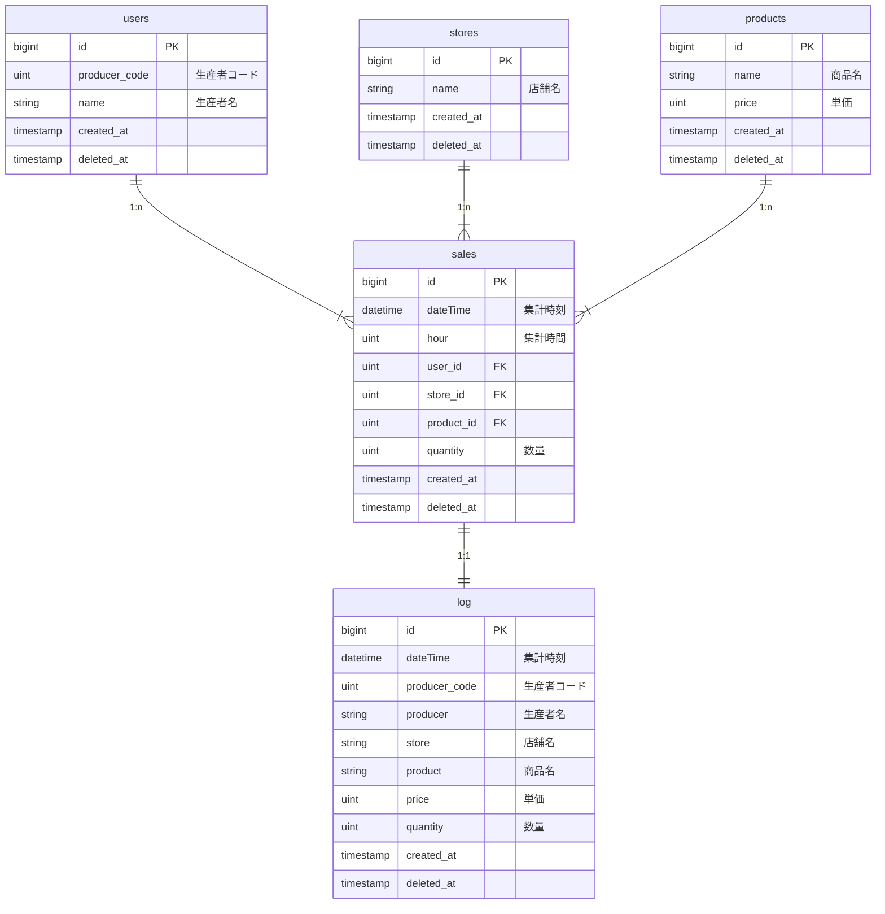

## ER Digram

```mermaid
erDiagram
    sales ||--|| log: "1:1"
    users ||--|{ sales: "1:n"
    stores ||--|{ sales: "1:n"
    products ||--|{ sales: "1:n"

    log {
        bigint id PK
        datetime dateTime "集計時刻"
        uint producer_code "生産者コード"
        string producer "生産者名"
        string store "店舗名"
        string product "商品名"
        uint price "単価"
        uint quantity "数量"
        timestamp created_at
        timestamp deleted_at
    }

    sales {
        bigint id PK
        datetime dateTime "集計時刻"
        uint hour "集計時間"
        uint user_id FK
        uint store_id FK
        uint product_id FK
        uint quantity "数量"
        timestamp created_at
        timestamp deleted_at
    }

    users {
        bigint id PK
        uint producer_code "生産者コード"
        string name "生産者名"
        timestamp created_at
        timestamp deleted_at
    }

    stores {
        bigint id PK
        string name "店舗名"
        timestamp created_at
        timestamp deleted_at
    }

    products {
        bigint id PK
        string name "商品名"
        uint price "単価"
        timestamp created_at
        timestamp deleted_at
    }
```
