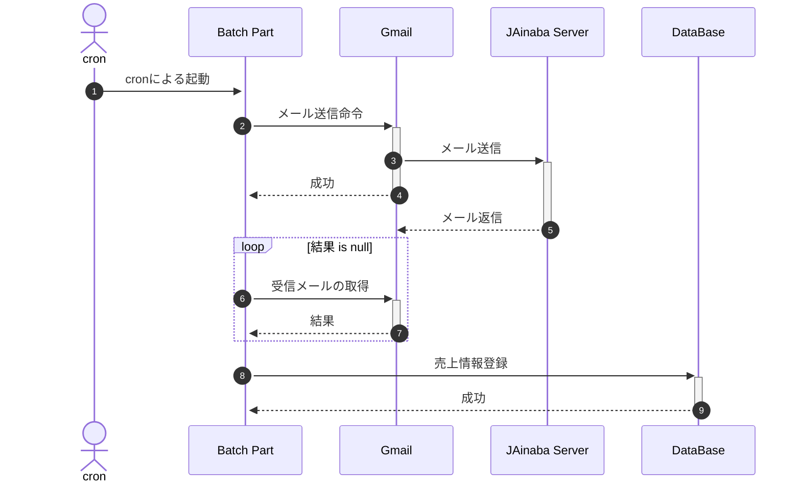

## Batch: シーケンス図

```mermaid
sequenceDiagram
	autonumber
	actor c as cron 
    participant bs as Batch Part
    participant ga as Gmail
	participant js as JAinaba Server
	participant db as DataBase
	c->>+bs: cronによる起動
	bs->>+ga: メール送信命令
	ga->>+js: メール送信
	ga-->>-bs: 成功
	js-->>-ga: メール返信
	loop 結果 is null
		bs->>+ga: 受信メールの取得
		ga-->>-bs: 結果
	end
	bs->>+db: 売上情報登録
	db-->>-bs: 成功
```
