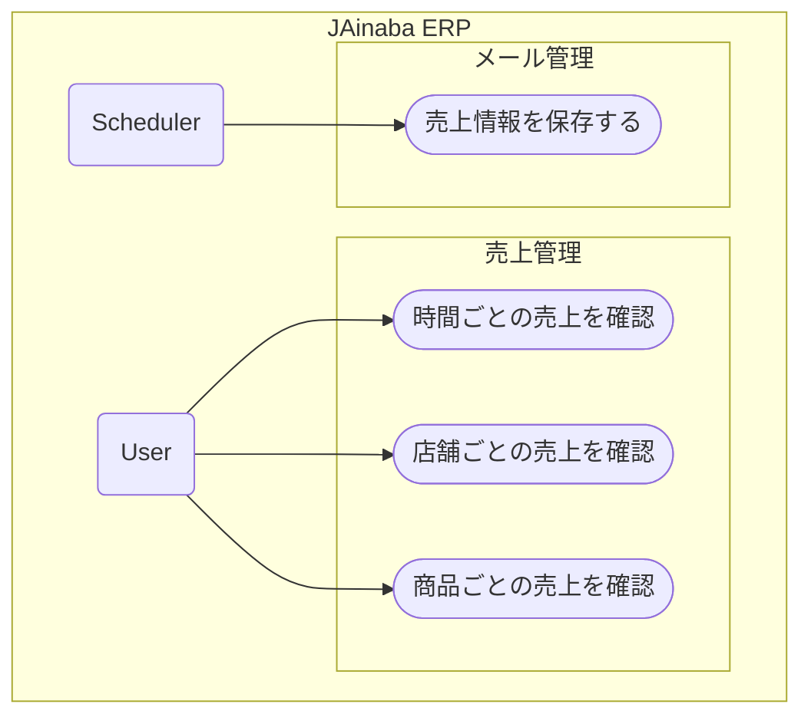

```mermaid
graph TB
    subgraph "JAinaba ERP"
        User(User)
        Scheduler(Scheduler)
        subgraph "売上管理"
            ShowSalesByTime([時間ごとの売上を確認])
            ShowSalesByStore([店舗ごとの売上を確認])
            ShowSalesByProduct([商品ごとの売上を確認])
        end
        subgraph "メール管理"
            StoreSales([売上情報を保存する])
        end
    end
    User --> ShowSalesByTime
    User -->ShowSalesByStore
    User -->ShowSalesByProduct
    Scheduler --> StoreSales
```
